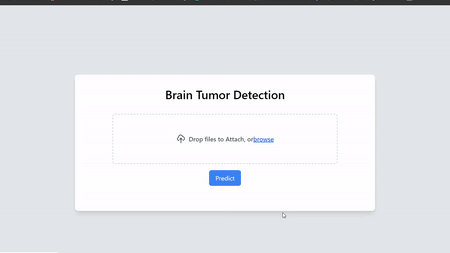

# Brain Tumor Detection Deep Learning Model With Web App

<div align="center">
    
</div>

## Overview

This repository hosts a deep learning model designed to detect brain tumors from MRI images. The model is built using convolutional neural networks (CNNs) and is available in two variants: one trained using binary cross-entropy loss and the other using categorical cross-entropy loss.
The deep learning model used in this project is a Convolutional Neural Network (CNN), specifically a variant known as a VGG-like architecture. Here's a breakdown of its key components:

1. Convolutional Layers:

   -The model uses several convolutional layers (Conv2D) with different filter sizes (e.g., 3x3) to extract features from the input images.
   -Each layer learns filters that activate based on specific patterns in the image.
   -The activation function (relu) introduces non-linearity, allowing the model to learn more complex relationships between features.

2. Pooling Layers:

   -Max pooling layers (MaxPooling2D) reduce the dimensionality of the data, selecting the maximum value from a window of pixels.
   -This helps to control overfitting and allows the model to focus on more prominent features.

3. Flattening Layer:

   -The Flatten layer transforms the multi-dimensional output of the convolutional layers into a one-dimensional vector.
   -This allows the dense layers to connect all the extracted features efficiently.

4. Dense Layers:

   -Dense layers (Dense) are fully-connected layers that perform traditional neural network computations.
   -The code uses two dense layers (one hidden layer with 64 units and an output layer with 1 unit).
   -The hidden layer learns more complex combinations of features extracted from the convolutional layers.
   -The output layer, with a single unit and a sigmoid activation, predicts the probability of a brain tumor (0 for no tumor, 1 for tumor).

5. Activation Functions:

   -ReLU (Rectified Linear Unit) is used in most layers to introduce non-linearity and improve model performance.
   -Sigmoid is used in the output layer because the task is binary classification (brain tumor or not).

## Pre-Trained Models

- **Binary Cross-Entropy Model (`binary_model.h5`):**
  - Trained using binary cross-entropy loss.
- **Categorical Cross-Entropy Model (`categorical_model.h5`):**
  - Trained using categorical cross-entropy loss.

## Setup and Requirements

Before using the model, ensure you have Python or later installed, along with the necessary dependencies listed in `requirements.txt`.

To set up the repository and run the model:

1. Clone the repository recursively:

   ```
   git clone  https://github.com/arfin-arif/brain-tumor-detection
   ```

2. Navigate to the project directory:

   ```
   cd brain-tumor-detection
   ```

3. Install the required packages:
   ```
   pip install -r requirements.txt
   ```

## Usage

1. **Running the Model:**
   - Start the Flask application module `app.py`:
     ```
     python app.py
     ```
2. **Training a Custom Model:**
   - Use the provided `train.py` module to train your own custom model.
   - Modify the code and parameters as needed to suit your requirements.

## Dataset

The model is trained on the Br35H Brain Tumor Detection 2020 dataset, available for download from [this link](https://www.kaggle.com/datasets/ahmedhamada0/brain-tumor-detection). Extract the images into the `datasets` folder within the project directory.
